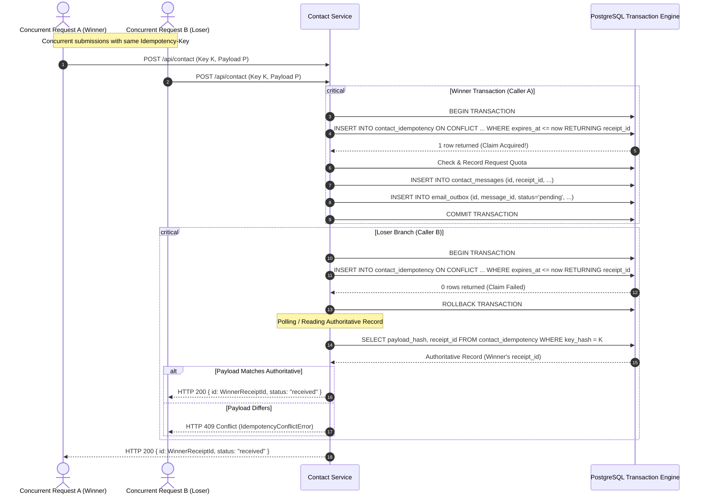
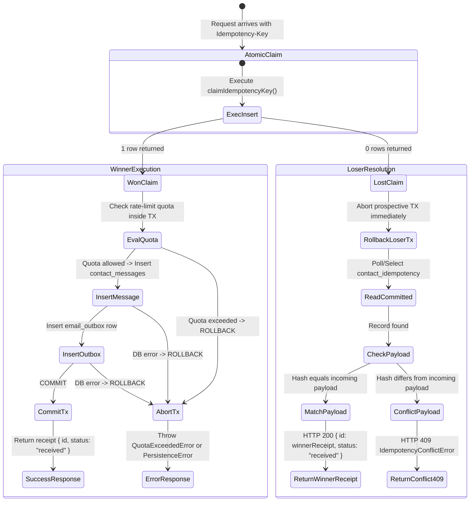

# A5/A6-CONTACT-IDEMPOTENCY-R2 Concurrency & Database-Safe Design

## 1. Executive Summary

During Gate G6 platform verification, an in-process `KeyedMutex` was introduced to arbitrate concurrent contact submissions. While this mitigated race conditions within a single Node.js event-loop instance, it did not satisfy the distributed correctness criteria of YOR WORLD production deployments:

* **Production Realities:** Production traffic executes across multiple stateless container instances, independent serverless executions (e.g. AWS Lambda / Vercel Functions), and distinct Node.js worker processes. These instances share **zero** memory.
* **Core Principle:** The database must be the sole, authoritative, distributed race arbiter.
* **Amendment:** This document formalizes the database-level transactional concurrency protocol for `A5/A6-CONTACT-IDEMPOTENCY-R2`, eliminating reliance on in-memory locks for correctness.

---

## 2. Invariants

| ID | Invariant | Description |
|---|---|---|
| **INV-1** | **Single Durable Message** | Same idempotency key + same payload concurrently $\to$ exactly ONE row in `public.contact_messages`. |
| **INV-2** | **Single Outbox Task** | Same idempotency key + same payload concurrently $\to$ exactly ONE row in `public.email_outbox`. |
| **INV-3** | **Single Authoritative Key Record** | Same idempotency key concurrently $\to$ exactly ONE active row in `public.contact_idempotency`. |
| **INV-4** | **Receipt Identity** | Every concurrent caller submitting identical payload with the same key receives the exact same receipt ID. |
| **INV-5** | **Deterministic Conflict** | Same idempotency key + conflicting payload $\to$ deterministic HTTP 409 (`IdempotencyConflictError`). The winning payload hash and receipt ID are immutable and cannot be overwritten. |
| **INV-6** | **Zero Cross-Process Leakage** | The protocol guarantees correctness across 2+ event-loop tasks, 2+ independent database connections, 2+ independent Node OS processes, and multiple serverless instances without shared memory. |
| **INV-7** | **Quota Boundary Integrity** | Benign concurrent retries with identical keys must not consume additional rate-limit quota attempts. Quota evaluation occurs strictly inside the winning transaction boundary after ownership is acquired. |
| **INV-8** | **Zero Surviving Orphans** | An aborted/rolled-back winning transaction leaves zero rows in `contact_messages`, `email_outbox`, or `contact_idempotency`. Subsequent callers can immediately acquire the key and succeed. |

---

## 3. Database-Level Race Arbitration Design

### 3.1 PostgreSQL Atomic Key Claim

The foundation of the distributed race arbiter is an atomic `INSERT ... ON CONFLICT (key_hash) DO UPDATE ... WHERE contact_idempotency.expires_at <= $now RETURNING receipt_id`.

```sql
INSERT INTO public.contact_idempotency (
  key_hash,
  payload_hash,
  receipt_id,
  expires_at
) VALUES ($1, $2, $3, $4)
ON CONFLICT (key_hash) DO UPDATE
SET
  payload_hash = EXCLUDED.payload_hash,
  receipt_id = EXCLUDED.receipt_id,
  expires_at = EXCLUDED.expires_at
WHERE public.contact_idempotency.expires_at <= $5
RETURNING receipt_id;
```

#### Behavior Matrix:
1. **Unclaimed Key:** No row exists for `key_hash`. The row is inserted with the prospective `receipt_id`. `RETURNING receipt_id` returns 1 row $\to$ **Claim WON**.
2. **Active Key (Raced):** An unexpired row exists (`expires_at > $now`). The conflict occurs, but the `WHERE expires_at <= $now` clause evaluates to `FALSE`. PostgreSQL performs NO update and returns 0 rows $\to$ **Claim LOST**.
3. **Expired Key:** An existing row exists, but `expires_at <= $now` (24h sliding window passed). The `WHERE` clause evaluates to `TRUE`. The row is atomically overwritten with the new payload hash, new receipt ID, and new expiration $\to$ **Claim WON (Legitimate Reuse)**.

---

### 3.2 Transaction Boundary & Lifecycle



---

## 4. Race Resolution State Machine



---

## 5. Failure and Edge Case Mitigations

### 5.1 Winner Delay Before Commit
If the winning process executes the claim but takes up to several hundred milliseconds to write the outbox and commit, concurrent losers will experience a lost claim. Losers employ a bounded exponential backoff poll (up to 10 attempts over 3 seconds) reading committed rows with read-committed isolation. As soon as the winner commits, the loser retrieves the authoritative receipt. If the winner fails to commit within the timeout, the loser throws HTTP 503 (`PersistenceError`), preserving downstream safety.

### 5.2 Winner Transaction Failure & Rollback
If the winner's transaction aborts due to a quota violation, constraint failure, or crash, PostgreSQL rolls back all changes. The prospective key claim in `contact_idempotency` vanishes completely. A subsequent request arrives to find no active key row and is able to claim the key normally without encountering deadlocks or permanent orphaned states.

### 5.3 Storage Outage (503)
If the database connection is severed or write transactions fail, all database operations are wrapped in typed exception handlers that surface `PersistenceError` (HTTP 503). At no point does the application acknowledge receipt of a contact message without durable database confirmation.

### 5.4 Role of In-Memory Mutex
An optional in-process `KeyedMutex` remains in the codebase as an optional fast-path optimization (`useInMemoryMutex: false` by default for tests to prove zero reliance). When enabled in a single-instance environment, it can reduce database round-trips for closely spaced duplicate clicks; however, correctness is 100% enforced by PostgreSQL.
