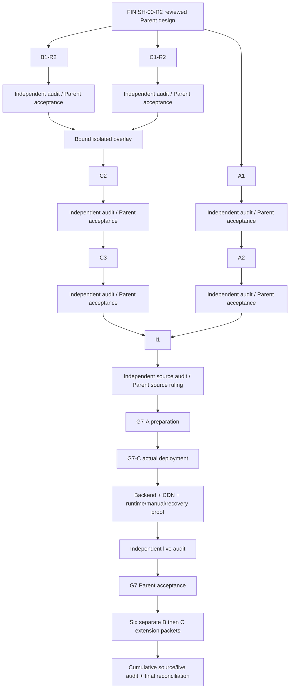

# Exact first handoffs and successor dependency DAG

First source base for A1, B1-R2 and C1-R2: **commit f62a43c5e71c00dcb89e28275ea81d842167db80; app tree 42ea29ec235225046a75959eb19eb386ac2f821d**. Use `git show` or an isolated checkout of that commit; unchanged canonical files are direct local inputs, original B1/C1 are correction reference only. Raw input identities are [input-hashes.json](input-hashes.json). Frozen design is this pack's [output-hashes.json](output-hashes.json), plus the subsequent Parent ruling. No maker starts from an unaccepted candidate.

## First three concrete packet slots (preserved issuance history)

The roots below became occupied by received candidates while this design review was pending. Preserve them. No formal Parent R2 ruling existed at that time; current delivery does not satisfy the acceptance prerequisite below. A later Parent continuation packet binds those exact candidates and allocates a fresh root for each required correction. Do not rerun an original prompt into an occupied root.

| Packet | Actual assigned maker | Delivery root | Concrete outcome and evidence | Dispatch prerequisite |
| --- | --- | --- | --- | --- |
| FINISH-A1 | Gemini #1 | deliveries/FINISH-A1/r2/ | All four block CRUD/reorder/save/reopen; actual AAL2 private draft preview; approved-media validation; stale-save 409; executed publish review; patch/source/real UI+negative security receipts | Accepted FINISH-00-R2 design; exact platform allowlist in 02 |
| FINISH-B1-R2 | Gemini #2 | deliveries/FINISH-B1-R2/ | Conforming exact exports/bindings; correct evaluated transforms/door/metadata; 8 paired clips; exposure/reference/camera correction; actual editable-to-export/browser/validator/budget proof | Accepted FINISH-00-R2 design; exact art artifacts in 03 |
| FINISH-C1-R2 | Gemini #3 | deliveries/FINISH-C1-R2/ | Correct first idle, late optional ownership/cancellation, valid same-scope progress, exact retry/watchdog, persistent pause and real browser-path receipts | Accepted FINISH-00-R2 design; exact runtime allowlist in 04 |

Read START_HERE, AGENTS, the selected P02/P04/P05 from `docs/planning/production-prompts/completion-2026-10-10/`, and this R2 pack. R2 supersedes conflicting old handoff details for these successor revisions; the historical pack remains unchanged. First handoff input source refs are exact, not a future acceptance commit. The Parent ruling freezes this pack's output manifest, eliminating a self-referential manifest hash in this file.

Each maker reads relevant actual canonical source/test/contracts and its own original candidate/audit. Missing external provider/doc/device inputs are named; they do not justify invented results. Do not change lock/dependency versions, three historical migrations, unrelated delivery roots or accepted evidence. Return actual `source/`, `source.patch` (platform/runtime), editable/exported files (art), `report.md`, raw-byte input/output hashes, changed-path list and bound command receipts. Include PASS/FAIL/NOT RUN per requirement and exact test scope. Commit/push only owned completed changes, and stop for independent review. Parent owns the ruling; the maker cannot accept itself.

A1/B1-R2/C1-R2 can execute independently in separate roots. Account aliases are the requested work lanes, not proof this session can access three Gemini accounts. The owner identifies Antigravity or an IDE with this folder open. This coordinator has no callable Gemini session control; separate sessions have returned the three candidates and scoped Git commits. Their reports record claimed execution, while acceptance requires independent evidence. Original local prompts were prepared here; delivery is observed from received files, without inventing an automatic dispatch event.

## Dependency graph

Every maker node contains the correction -> independent delta audit -> Parent ruling loop when defects exist. Unaccepted output does not satisfy a graph edge. External blocked inputs remain open while independent maker work proceeds.

## Isolated C2 assembly, distinct from canonical I1 integration

Parent allocates an exact assembly candidate under `deliveries/FINISH-C2/base/` after B1-R2 and C1-R2 acceptance. It contains a copy/isolated checkout of the immutable app base, then accepted C1-R2 patch, then accepted B1-R2 asset mappings at their future canonical URLs. The assembly contains no unreviewed source rewrite. The C2 patch itself performs the accepted filename/clip/catalog switch. Build source/asset bindings describe this provisional state honestly; C2 has no authority to modify canonical app.

Record in `assembly-manifest.json`: base commit/app tree; predecessor ruling paths/raw hashes; patch SHA-256/application order; every asset source/destination/SHA-256; full assembled source/content hash inventory; pinned package/lock hashes; any material conflict; actual patch check/apply receipts. Parent verifies same paths are not silently overwritten. If source/asset manifests need a minimal test-base mapping, the mapping is explicitly recorded, not called accepted release output. Current public assets/release manifest are historical; only final I1 regenerates the production manifest.

C3 consumes accepted C2's exact base+patch, also isolated. A2 consumes accepted A1's exact base+patch, isolated. Bind their actual accepted hashes in successor dispatch packets when they exist. This pack **does not mark A2/C2/C3/I1 ready now** and does not fabricate an unimplemented migration/output hash. No I1 -> C2 prerequisite remains.

I1 later assembles canonical source base -> accepted A1 -> accepted A2 -> accepted C1-R2 -> accepted C2 -> accepted C3, with accepted B1-R2 assets and the narrow site/manifest seams specified in 04. Its canonical write permission/source candidate/release identifiers are issued by a separate Parent packet. Overlapping runtime paths are successive full accepted replacements, not a blind patch stack. Verify each predecessor against its declared base; reject conflicts requiring semantic decisions rather than guessing a merge. Regenerate combined identities/clean build and independently audit the exact resulting candidate before source acceptance.

## Production and full-product continuation

Existing owner authorization `G7-OWNER-AUTH-20261006` covers production setup/publishing. G7-A prepares actual services/jobs/fallback; G7-C binds and deploys the accepted source; then G7-A proves real backend/security/outbox/rollback/restore, G7-B proves real CDN hashes/cache/transfer budgets, and G7-C proves fresh live runtime and all physical/assistive sessions. Independent GPT review and separate Parent major-gate acceptance follow. A successful deploy command is not G7 closure.

EXT-01 mug/drinking, EXT-02 wearable headphones, EXT-03 drawers, EXT-04 weather/daylight, EXT-05 moods/greetings, EXT-06 total 5–8 distinct easter eggs remain required. Each receives one art packet/audit/acceptance, then one runtime packet/audit/acceptance with cumulative dependencies. Same maker executes sequentially. Final cumulative source/live evidence must cover later changed assets/code; earlier V1 G7 cannot accept them by inheritance.
