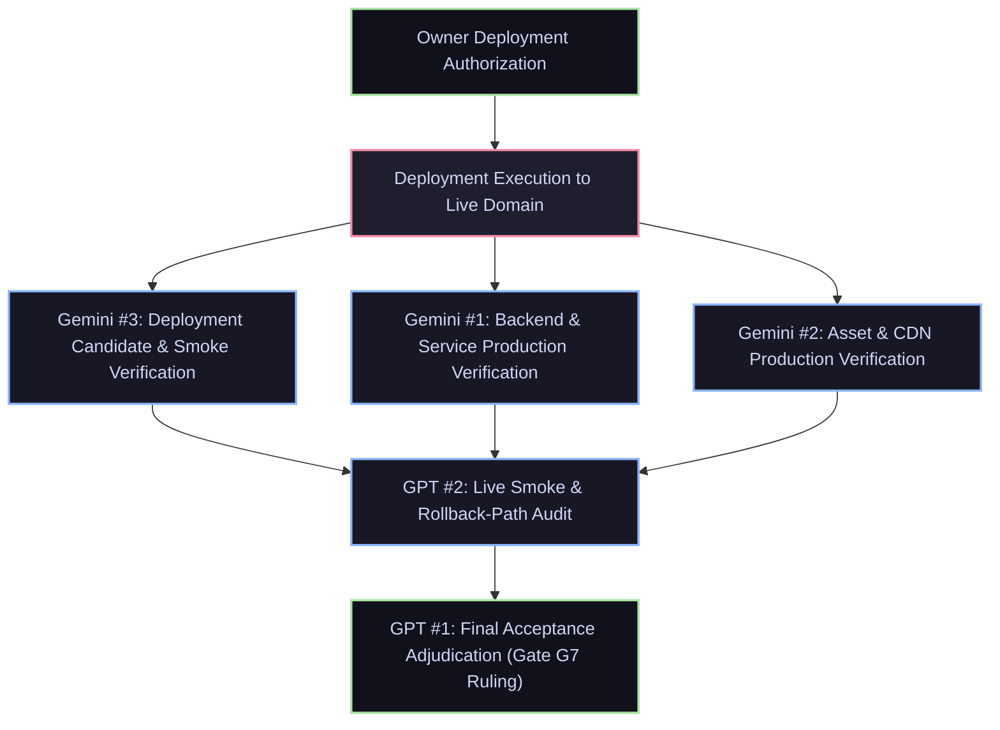

# YOR WORLD — Gate G7 Production Release Protocol & Verification Orders

**Authority:** Human Owner & Parent Codex (Technical Gate Authority)  
**Date:** 2026-10-02  
**Scope:** Gate G7 (Production Release, Live Verification & Final Acceptance)  
**Repository:** [https://github.com/yorayriniwnl/Yor-World](https://github.com/yorayriniwnl/Yor-World), branch `main`  
**Binding Release Condition:** **ONLY AFTER OWNER AUTHORIZES DEPLOYMENT.**  
**Core Governance Mandate:** **G7 IS NOT COMPLETE MERELY BECAUSE A DEPLOYMENT COMMAND SUCCEEDED.**

---

## 1. Executive Directive & Release Authority

> [!CAUTION]
> ### MANDATE 1: STRICT OWNER DEPLOYMENT AUTHORIZATION
> No worker, script, automation, or subagent may execute a deployment command to production infrastructure, publish to a public domain, provision paid hosting, or modify production records **UNTIL THE OWNER EXPLICITLY AUTHORIZES DEPLOYMENT**.
> Preparation, staging candidate builds, dry runs, and local verification may proceed; production deployment remains locked.

> [!IMPORTANT]
> ### MANDATE 2: G7 IS NOT COMPLETE MERELY BECAUSE A DEPLOYMENT COMMAND SUCCEEDED
> A successful deployment command exit code 0, a hosting provider dashboard "Deployed" status, or CI pipeline completion is merely a deployment trigger. It **NEVER** constitutes completion or acceptance of Gate G7.
> Gate G7 is complete **ONLY** after independent, multi-lane empirical verification across all 10 mandatory production requirements against the live, public domain, followed by formal parent acceptance (`GPT #1`).

---

## 2. Multi-Account Verification Lanes for Gate G7

To guarantee independent checks and prevent self-approval or blind spots, Gate G7 verification is strictly partitioned across five distinct account lanes:



### 2.1. Gemini #3 — Deployment Candidate & Smoke Verification
- **Primary Responsibility:** Candidate bundle integrity, pre-flight packaging, and initial live production smoke verification.
- **Scope & Verification Actions:**
  1. Build candidate validation: verify exact release commit hash (`git rev-parse HEAD`), zero uncommitted files, clean production build (`pnpm build`), and schema/manifest alignment.
  2. Pre-flight checks: inspect `ReleaseManifest`, ensure all asset URLs and publication revision tokens are resolved without placeholder or `localhost` paths.
  3. Fresh live smoke execution: immediately upon authorized deployment, execute initial HTTP probes against the live domain:
     - Root route `/` (HTTP 200, semantic HTML present in initial payload).
     - Core navigation elements present and navigable.
     - World stage initialization hook functional without uncaught client exceptions.
     - Initial performance check (TTFB, LCP baseline under live CDN).
  4. Returns: `deliveries/G7/gemini-3-smoke-report.md` with raw curl/Playwright logs, HTTP status codes, and browser console receipts.

### 2.2. Gemini #1 — Backend & Service Production Verification
- **Primary Responsibility:** Live production database, auth/security enforcement, API routes, contact processing, and production configuration.
- **Scope & Verification Actions:**
  1. Production Configuration Audit:
     - Verify complete environment separation: zero staging/development database credentials or secrets in client bundle.
     - Strict Content Security Policy (CSP), HSTS, `X-Content-Type-Options: nosniff`, `X-Frame-Options: DENY`, and CORS headers verified on live responses.
  2. Database & RLS Enforcement:
     - Verify all 15 production tables in Supabase / PostgreSQL have active RLS.
     - Anonymous queries cannot access private tables (`admin_users`, `contact_submissions`, `draft_revisions`, `audit_log`).
     - AAL2 TOTP MFA gate strictly blocks unauthorized access to `/api/admin/*` and CMS mutations with HTTP 401/403.
  3. Contact Behavior in Production:
     - Submit test contact payload to live `/api/contact`.
     - Verify honeypot rejection (HTTP 400 for bot fields), body size limit enforcement (HTTP 413 for oversized payloads), and rate limiting (HTTP 429 after burst threshold).
     - Verify atomic transaction: submission persisted in database, queued in durable outbox, and unique client receipt returned.
     - Verify zero PII leak in server logs or telemetry.
  4. Returns: `deliveries/G7/gemini-1-backend-report.md` with sanitized API request/response traces, RLS denial receipts, and rate-limit logs.

### 2.3. Gemini #2 — Asset & CDN Production Verification
- **Primary Responsibility:** Live CDN asset delivery, manifest cryptographic integrity, cache behavior, and 3D budget verification.
- **Scope & Verification Actions:**
  1. Asset Manifest Cryptographic Audit:
     - Fetch live production `manifest.json`.
     - Download every registered asset (`room-shell.glb`, `resident-production.glb`, `fixture-production.glb`, `interactive-props.glb`, audio files, textures).
     - Compute actual SHA-256 hashes of downloaded bytes; verify 100% match against declared manifest hashes.
  2. CDN & Cache Configuration:
     - Verify static assets serve `Cache-Control: public, max-age=31536000, immutable`.
     - Verify mutable roots (`/`, `manifest.json`) serve appropriate validation headers (`must-revalidate`, `stale-while-revalidate`, or short TTL).
     - Verify Brotli / Gzip compression enabled for all text and JSON responses.
     - Verify byte-range requests (`Accept-Ranges: bytes`, HTTP 206) work for large binary assets.
  3. Live Asset Budgets:
     - Total compressed transfer for essential entry assets $\le 6\text{ MiB}$ on desktop, $\le 3\text{ MiB}$ on mobile.
     - Zero broken asset URLs (HTTP 404/403/500).
  4. Returns: `deliveries/G7/gemini-2-asset-cdn-report.md` with CDN response headers, SHA-256 validation table, and byte-budget audit.

### 2.4. GPT #2 — Live Smoke & Rollback-Path Audit
- **Primary Responsibility:** Adversarial live smoke test suite, cross-device UX verification, and independent audit of the rollback path.
- **Scope & Verification Actions:**
  1. Comprehensive Live Smoke Battery:
     - Execute live Playwright suite against public production domain (Chromium, Edge, Firefox, WebKit).
     - Public routes: verify direct URL entry, hard refresh, and client-side transitions for `/`, `/about`, `/contact`, `/resume`, and all verified project case studies (`/projects/ai-vs-real`, `/projects/zenith`, `/projects/helios`, `/projects/talks`).
     - Unverified candidate protection: verify `/projects/candidatex` returns clean HTTP 404 page and cannot be entered from UI launcher.
     - World entry flow: test live doorway sequence ($\le 8.0\text{s}$), instant skip button ($\le 50\text{ms}$ to settled `HOME`), camera transition to presets (`monitor`, `pc`, `energy`, `scanner`, `microphone`), and avatar acknowledgement.
     - Fallback verification: test page with JavaScript disabled (complete HTML portfolio rendered, useful content immediately available); test WebGL disabled / context loss (graceful fallback banner, zero crash, all projects readable).
  2. Rollback-Path Audit & Rehearsal:
     - Audit production hosting rollback mechanism (Vercel / Cloudflare / container instant rollback to previous immutable deployment).
     - Verify database migration backward compatibility: assert that the previous deployment code functions correctly with current schema without data corruption.
     - Rehearse DNS/CDN traffic shifting and emergency rollback procedures under synthetic failure.
     - Verify Maximum Allowable Downtime during rollback $\le 5\text{ minutes}$ ($RTO \le 300\text{s}$, $RPO = 0$).
  3. Returns: `deliveries/G7/gpt-2-smoke-and-rollback-report.md` with recorded Playwright traces, route matrix results, and verified rollback runbook receipt.

### 2.5. GPT #1 — Final Acceptance Adjudication
- **Primary Responsibility:** Gate G7 ruling authority, reconciliation of all verification evidence, and issuance of formal release acceptance.
- **Scope & Verification Actions:**
  1. Reconcile evidence dossiers from Gemini #3, Gemini #1, Gemini #2, and GPT #2.
  2. Evaluate all 10 mandatory exit requirements against live empirical data.
  3. Confirm that no maker approved its own deliverable and all checks were performed against the live domain.
  4. Issue formal G7 Acceptance Ruling: **G7 ACCEPTED (`G7-R1`)** or **G7 REWORK** with prioritized defect ledger.

---

## 3. The 10 Mandatory G7 Exit Requirements

Gate G7 cannot be satisfied without complete, documented, empirical proof for every item in this matrix:

| # | Requirement | Owning Lane(s) | Verification Standard & Criteria | Failure Conditions |
|:--|:---|:---:|:---|:---|
| **1** | **Live Domain** | Gemini #3, GPT #2 | Public production domain resolves cleanly over DNS; TLS/SSL certificate valid with modern cipher suites; HTTP automatically redirects to HTTPS (301/308); correct canonical headers present. | Certificate error, insecure mixed content, domain redirect loops, or DNS resolution failure. |
| **2** | **Fresh Smoke** | Gemini #3, GPT #2 | Automated and manual smoke test suites executed *live* against production domain post-deployment; 100% of critical paths pass. Stale pre-deployment or staging logs explicitly rejected. | Any failing test assertion, unhandled exception in browser console, or reliance on pre-deployment evidence. |
| **3** | **Public Routes** | GPT #2 | Direct URL access, browser refresh, Back/Forward history navigation for `/`, `/about`, `/contact`, `/resume`, and 4 verified projects (`ai-vs-real`, `zenith`, `helios`, `talks`). CandidateX correctly returns HTTP 404. | 500 error on refresh, broken client router links, blank page on deep link, or CandidateX exposing unverified claims. |
| **4** | **World Entry** | Gemini #3, GPT #2 | 3D room loads on demand upon "Enter Studio" action; asset loading spinner with honest progress; cinematic entrance sequence completes in $\le 8.0\text{s}$; instant Skip settles to `HOME` in $\le 50\text{ms}$; avatar acknowledgement functions. | World fails to load, entrance hangs, Skip freezes camera, avatar clips glitch, or WebGL memory exceeds 160MB ceiling. |
| **5** | **Fallback** | GPT #2 | Complete HTML portfolio immediately accessible without WebGL, with JavaScript disabled, or upon WebGL context loss. Clear non-intrusive fallback notification; zero content trapped in canvas. | Blank screen without WebGL, broken navigation with JS disabled, or trapped dialogs on mobile. |
| **6** | **Contact Behavior** | Gemini #1 | Live form submits successfully; input sanitized; honeypot blocks automated spam; burst submissions trigger HTTP 429 rate limit; submissions atomically persisted with unique receipt ID returned; zero PII logged. | Form submission fails, unhandled 500 on spam burst, dropped messages without outbox entry, or raw email addresses leaked in logs. |
| **7** | **Production Configuration** | Gemini #1 | Production environment variables verified; zero staging/test API keys leaked; strict CSP and security headers active; Supabase production instance secured with 15/15 RLS policies; AAL2 MFA enforced. | Dev/staging secrets exposed in client bundle, missing RLS on any public table, or permissive CORS wildcard (`*`) on private APIs. |
| **8** | **Asset Loading** | Gemini #2 | All 3D assets, textures, and media served via production CDN with immutable cache headers; 100% SHA-256 match against production `manifest.json`; transfer $\le 6\text{ MiB}$ (desktop) / $\le 3\text{ MiB}$ (mobile). | Broken asset URLs (404), mismatched SHA-256 checksums, uncompressed assets, or exceeding transfer budget ceilings. |
| **9** | **Monitoring** | Gemini #1 | Live health endpoint (`/api/health`) returns HTTP 200 with database connectivity confirmation; error logging active; uptime probe operational; zero visitor PII retained in telemetry. | Health probe returns 500, silent error swallowing, or telemetry capturing visitor email/IP data. |
| **10** | **Rollback Readiness** | GPT #2 | Rehearsed, documented rollback procedure verified; previous stable deployment artifact pinned and ready for immediate redeployment; database schema backward compatible; $RTO \le 5\text{ minutes}$. | Rollback procedure unverified, schema migrations breaking backward compatibility, or redeployment requiring manual intervention > 5m. |

---

## 4. Rollback Readiness & Recovery Runbook

Rollback readiness is a hard gating requirement, not an operational afterthought.

### 4.1. Rollback Invariants
1. **Zero Data Loss ($RPO = 0$):** Rolling back application code must never drop, truncate, or corrupt user submissions or published revisions.
2. **Backward Compatible Migrations:** All database migrations follow the expand-and-contract pattern. New columns must be nullable or have defaults; deleted columns must remain deprecated before removal.
3. **Immutable Deployment Artifacts:** Every release candidate corresponds to a pinned git commit hash, Docker image digest, or immutable CDN deployment ID.

### 4.2. Rollback Execution Protocol
If a P0 defect is discovered during post-deployment live verification:
```
STEP 1: Incident declared by any verification lane (Gemini #1, #2, #3, or GPT #2).
STEP 2: Instant deployment rollback triggered:
        - Revert routing to previous immutable deployment snapshot ID via CDN / Hosting platform.
        - Target completion time: < 120 seconds.
STEP 3: Verify rollback target:
        - Run smoke suite against live domain to verify recovery of previous stable baseline.
STEP 4: Database state verification:
        - Confirm all contact submissions created during failed deployment window remain intact.
STEP 5: Post-rollback review and defect assignment:
        - Log root cause, assign corrective packet to responsible maker, and lock G7.
```

---

## 5. Verification Commands & Evidence Ledger

All verification checks must generate reproducible, timestamped evidence logs under `deliveries/G7/evidence/`:

```powershell
# 1. Deployment Candidate Build & Pre-flight
pnpm build
pnpm test:unit
pnpm test:e2e
node scripts/release/validate-release-manifest.mjs

# 2. Live Smoke Verification (Executed against https://<production-domain>)
$env:PRODUCTION_URL = "https://yorworld.com"
node scripts/release/verify-g7-release.mjs --url $env:PRODUCTION_URL

# 3. Asset & CDN Verification
node scripts/release/verify-cdn-assets.mjs --manifest public/assets/manifest.json --origin $env:PRODUCTION_URL

# 4. Security & Configuration Audit
node scripts/release/verify-security-headers.mjs --url $env:PRODUCTION_URL
pnpm test:integration tests/integration/production-rls.test.ts
```

---

## 6. Exit Criteria for G7 Acceptance

Gate G7 is closed and production release is finalized **IF AND ONLY IF**:
1. Human Owner has provided explicit, recorded authorization for deployment.
2. Production deployment has been executed to the designated live domain.
3. Gemini #3 returns PASS on Deployment Candidate & Initial Smoke.
4. Gemini #1 returns PASS on Backend, RLS, Auth, Contact, and Configuration.
5. Gemini #2 returns PASS on CDN Assets, Manifest Integrity, and Transfer Budgets.
6. GPT #2 returns PASS on Live Adversarial Smoke, Routes, World Entry, Fallbacks, and Rollback Rehearsal.
7. GPT #1 audits all reports, verifies all 10 requirements, and signs the formal **G7 ACCEPTED** ruling.
